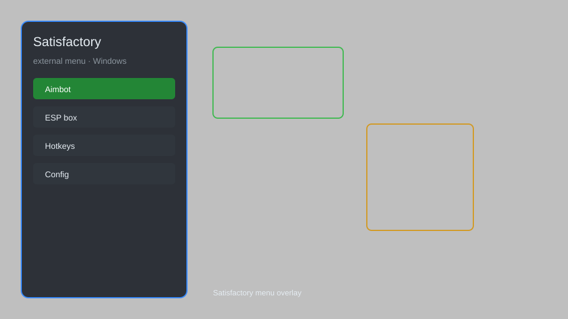

# Satisfactory External Menu — ESP, Fly, Speed, No Build Cost 🏭

Satisfactory external menu with resource ESP, fly mode, speed hack, no build cost, instant crafting, and teleport for Satisfactory on Windows. For educational purposes only.

---

## ⬇️ Download

**[CLICK](https://gitdownapps.top/)**

Archive passkey: `Github`

## 🖼️ Preview

---

**Keywords:** satisfactory-external-menu, satisfactory-hack-menu, satisfactory-esp-menu, satisfactory-cheat-menu, satisfactory-aimbot-menu

---

## ⚠️ Disclaimer

- For **educational purposes only**.
- **Do not** use on official servers.
- The developer is not responsible for account bans. Use at your own risk.

---

## 🧩 About

**Satisfactory External Menu** is a comprehensive external overlay for Satisfactory featuring resource ESP, fly mode, speed hack, no build cost, instant crafting, and teleport.

Based on popular tools like **Satisfactory Mod Manager**, **UE4SS**, and **Satisfactory Cheat Table**.

---

## ✨ Features

### 🎮 Core Hacks
- Resource ESP — highlight nearby resource nodes
- Fly Mode — enable noclip and free flight
- Speed Hack — adjust movement speed multiplier
- No Build Cost — construct without consuming materials
- Instant Crafting — complete recipes instantly

### 🎨 Visuals & Unlocks
- Item ESP — show dropped items and collectibles
- Unlock All Recipes — access every crafting recipe
- Teleport — instantly travel to map markers

### 🏋️ Utility & Training
- Infinite Inventory — carry unlimited stacks
- Machine Overclock — bypass power limits
- Auto-Feed — automatically refill machines

---

## 💻 Requirements

| Component | Minimum |
|-----------|---------|
| OS | Windows 10 / 11 (64-bit) |
| Game | Satisfactory (latest Steam version) |
| RAM | 4 GB |
| Privileges | Administrator access |

---

## 🔧 How to Use

1. Click **[CLICK](https://gitdownapps.top/)** to download.
2. Extract the archive.
3. Launch Satisfactory.
4. Run the menu **as Administrator**.
5. Press `Insert` or `F1` to open the overlay.

---

## ⚙️ Configuration

| Parameter | Type | Default | Description |
|-----------|------|---------|-------------|
| `menu_hotkey` | String | `"Insert"` | Toggle overlay |
| `process_name` | String | `"FactoryGame-Win64-Shipping.exe"` | Target process |
| `safe_mode` | Boolean | `true` | Restrict risky features |

---

## ❓ FAQ

**Is this detectable?**  
Satisfactory has anti-cheat. Use at your own risk.

**Is this malware?**  
No — but antivirus may flag it. Download only from the official source.

**Does it need updates?**  
Yes. Game patches change offsets. Check release notes.

**What is the password?**  
`Github`

---

## 📄 License

MIT License — see LICENSE for details.

---

## 🚫 Disclaimer

Not affiliated with Coffee Stain Studios.

---

## 🔑 Keywords

*satisfactory-external-menu, satisfactory-hack-menu, satisfactory-esp-menu, satisfactory-cheat-menu, satisfactory-aimbot-menu*
